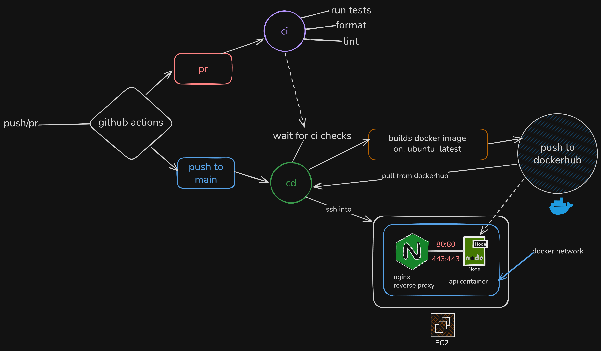

# TaskPulse API

A focused backend API for user authentication and task management, built while learning real-world DevOps fundamentals: Docker, CI/CD, and cloud deployment.



## Why this project

This project started as a TypeScript + Express API and grew into a full backend engineering practice repo.

It helped me learn:

- API design with auth-protected resources
- schema validation and middleware-driven architecture
- Docker image creation and optimization with multi-stage builds
- CI checks on pull requests (tests, formatting, linting)
- CD deployment flow to EC2 using containers

## Core Features

- User registration and login
- Email verification flow
- Password reset flow
- JWT-based route protection
- Task CRUD per authenticated user
- Health endpoint for deployment checks

## Tech Stack

- Node.js, TypeScript, Express
- MongoDB + Mongoose
- Zod validation
- Jest + Supertest + mongodb-memory-server
- ESLint + Prettier
- Docker
- GitHub Actions (CI/CD)

## Project Structure

```text
src/
  app.ts
  index.ts
  controllers/
  middlewares/
  models/
  routes/
  services/
  validators/
  __tests__/

.github/workflows/
  ci.yml
  cd.yml

Dockerfile.dev
Dockerfile.prod
```

## Getting Started (Local)

1. Install dependencies

```bash
npm install
```

2. Configure environment values in `.env`

```env
PORT=8080
MONGO_CLOUD_URI=
JWT_SECRET=
APP_URL_PROD=http://localhost:8080
EMAIL_HOST=smtp.gmail.com
EMAIL_USER=
EMAIL_PASS=
```

3. Start development server

```bash
npm run dev
```

## Scripts

- `npm run dev` - run API in development
- `npm run build` - compile TypeScript to `dist`
- `npm start` - run compiled app
- `npm test` - run tests
- `npm run test:watch` - run tests in watch mode
- `npm run test:coverage` - run coverage report
- `npm run lint` - lint codebase
- `npm run lint:fix` - auto-fix lint issues
- `npm run format` - format code with Prettier
- `npm run format:check` - check formatting only

## Docker

### Development image

```bash
docker build -t taskpulse-api:dev -f Dockerfile.dev .
docker run --rm -p 8080:8080 --env-file .env taskpulse-api:dev
```

### Production image

```bash
docker build -t taskpulse-api:prod -f Dockerfile.prod .
docker run -d --name taskpulse-api -p 80:8080 --env-file .env taskpulse-api:prod
```

The production Dockerfile uses a multi-stage build to keep runtime images smaller and cleaner.

## CI/CD Overview

- **CI (`ci.yml`)** runs on pull requests to `main`
  - tests
  - formatting check
  - linting
- **CD (`cd.yml`)** runs on push to `main`
  - build and push Docker image
  - deploy container to EC2
  - verify with health endpoint

## Key Endpoints

### Auth

- `POST /auth/register`
- `GET /auth/verify-email`
- `POST /auth/login`
- `POST /auth/forgot-password`
- `POST /auth/reset-password`

### Tasks (protected)

- `GET /tasks`
- `POST /tasks/create-task`
- `GET /tasks/:id`
- `PUT /tasks/:id`
- `DELETE /tasks/:id`

## What I improved in this project

- moved app bootstrapping into `src/app.ts` + `src/index.ts` for testability
- added test setup with isolated in-memory database
- set up lint + format standards
- built CI/CD pipeline for reliable delivery
- containerized app and validated deployment flow on EC2


---

If you are learning backend + DevOps together, this repo is intentionally practical: build features, validate quality in CI, and ship with containers.
